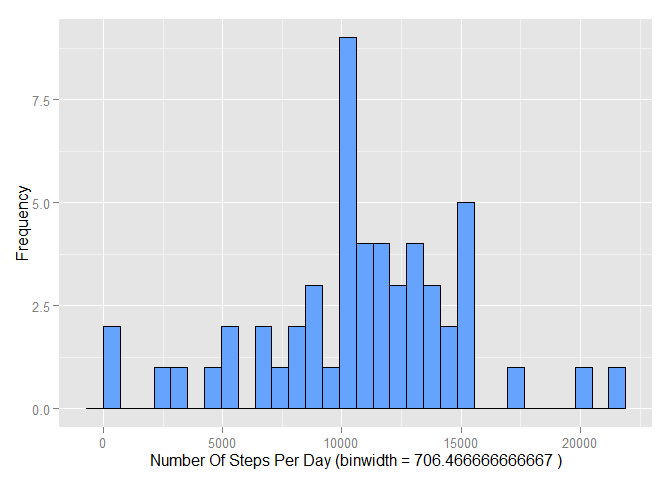
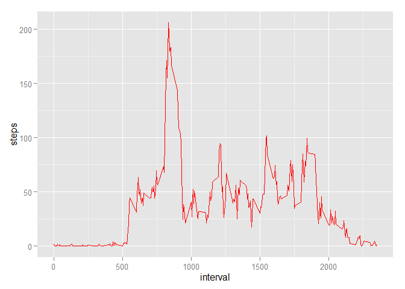
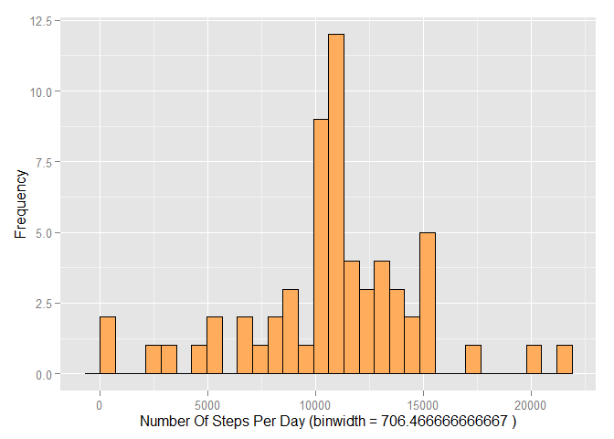
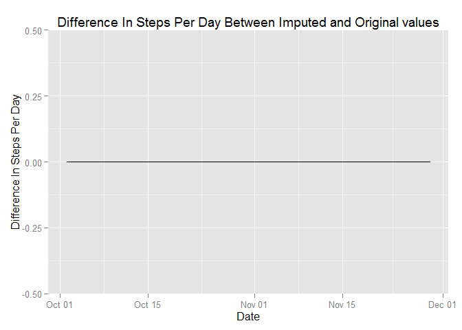
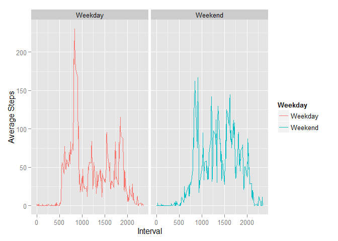

# Reproducible Research: Peer Assessment 1

# By Devon Ly

## A. Loading and preprocessing the data

#### A1. Unzip, load CSV file into a data frame and load additional packages


```r
library(ggplot2)                                                        # Use ggplot2 as our plotting system

unzip("activity.zip")                                                   # Unzip file
Activity_Data <- read.csv( "activity.csv", colClasses = "character" )   # Read CSV file
```

#### A2. Process and transform data in preparation for analysis


```r
Activity_Data$steps    <- as.numeric(Activity_Data$steps)               # Convert character to number
Activity_Data$date     <- as.Date(Activity_Data$date)                   # Convert character to date
Activity_Data$interval <- as.numeric(Activity_Data$interval)            # Convert character to number
```

## B. What is mean total number of steps taken per day?

#### B1. Calculate total number of steps taken per day using the aggregate function


```r
Steps_Per_Day <- aggregate( steps ~ date, data = Activity_Data, FUN = sum )
```

#### B2. Generate histogram of total number of steps taken each day


```r
# Divide the steps range into 30 bin
bin_size <- max(Steps_Per_Day$steps) / 30   

# Create the histogram
plot1 <- qplot(
                 steps,
                 data = Steps_Per_Day,
                 geom = "histogram",
                 xlab = paste("Number Of Steps Per Day (binwidth =", bin_size, ")" ),
                 ylab = "Frequency",
                 binwidth = bin_size
              )
# Change (horrible) default colour
plot1 <- plot1 + geom_bar( 
                            binwidth = bin_size,                        # Supply again to suppress warnings
                            fill = "#66A3FF",                           # Change the bar fill colour
                            color = "black"                             # Change the bar outline colour 
                         )
# Display the plot
print(plot1)
```

 

#### B3. What is the mean steps taken per day?


```r
original_mean <- mean(Steps_Per_Day$steps, na.rm = TRUE)   # Calculate mean ignoring missing values
original_mean
```

```
## [1] 10766.19
```

#### B4. What is the median steps taken per day?


```r
original_median <- median(Steps_Per_Day$steps, na.rm = TRUE) # Calculate median ignoring missing values
original_median
```

```
## [1] 10765
```

## C. What is the average daily activity pattern?

##### C1. Make a time series plot (i.e. type = "l") of the 5-minute interval (x-axis) and the average number of steps taken, averaged across all days (y-axis)


```r
# Generate a data frame of average step by interval
Average_Steps_Per_Interval <- aggregate( steps ~ interval, data = Activity_Data, FUN = mean)

# Create the line graph
plot1 <- ggplot( data = Average_Steps_Per_Interval, aes( x = interval, y = steps, group = 1))
plot1 <- plot1 + geom_line(col = "red")

# Display the plot
print(plot1)
```

 

#### C2. Which 5-minute interval, on average across all the days in the dataset, contains the maximum number of steps?


```r
Average_Steps_Per_Interval[ Average_Steps_Per_Interval$steps == max(Average_Steps_Per_Interval$steps), 1]
```

```
## [1] 835
```

## D. Imputing missing values

###There are a number of days/intervals where there are missing values (coded as NA). The presence of missing days may introduce bias into some calculations or summaries of the data.

#### D1. Calculate and report the total number of missing values in the dataset (i.e. the total number of rows with NAs)


```r
nrow(Activity_Data[ is.na( Activity_Data$steps), ])
```

```
## [1] 2304
```

#### D2. Devise a strategy for filling in all of the missing values in the dataset. The strategy does not need to be sophisticated. For example, you could use the mean/median for that day, or the mean for that 5-minute interval, etc.
#### D3. Create a new dataset that is equal to the original dataset but with the missing data filled in.


```r
# Merge original data set with our calculated data set containing average steps
Imputed_Data <- merge( 
                        Activity_Data, 
                        Average_Steps_Per_Interval,
                        by = "interval",
                        all.x = TRUE,
                        suffixes = c("_x","_y")
                      )
# Replace NA values with the mean for that 5 minute interval        
Imputed_Data$steps_x[ is.na(Imputed_Data$steps_x)] <- Imputed_Data$steps_y[ is.na(Imputed_Data$steps_x)]
```


#### D4. Make a histogram of the total number of steps taken each day and Calculate

```r
# Calculate steps per day from imputed data
Imputed_Steps_Per_Day <- aggregate( steps_x ~ date, data = Imputed_Data, FUN = sum )

# Divide the steps range into 30 bins
bin_size <- max(Steps_Per_Day$steps) / 30   

# Create the histogram
plot1 <- qplot(
                 steps_x,
                 data = Imputed_Steps_Per_Day,
                 geom = "histogram",
                 xlab = paste("Number Of Steps Per Day (binwidth =", bin_size, ")" ),
                 ylab = "Frequency",
                 binwidth = bin_size
              )
# Change (horrible) default colour
plot1 <- plot1 + geom_bar( 
                            binwidth = bin_size,                        # Supply again to suppress warnings
                            fill = "#FFAD5C",                           # Change the bar fill colour
                            color = "black"                             # Change the bar outline colour 
                         )
# Display the plot
print(plot1)
```

 

#### and report the mean and median total number of steps taken per day.

The mean using imputed data is

```r
imputed_mean   <- mean(Imputed_Steps_Per_Day$steps_x)     # Calculate mean 
imputed_mean
```

```
## [1] 10766.19
```

The median using imputed data is

```r
imputed_median <- median(Imputed_Steps_Per_Day$steps_x)   # Calculate median
imputed_median
```

```
## [1] 10766.19
```

#### Do these values differ from the estimates from the first part of the assignment?

#### Difference with the mean value

```r
paste( "The Mean when NA values ARE NOT imputed = ", original_mean )
```

```
## [1] "The Mean when NA values ARE NOT imputed =  10766.1886792453"
```

```r
paste( "The Mean when NA values ARE imputed is  = ", imputed_mean )
```

```
## [1] "The Mean when NA values ARE imputed is  =  10766.1886792453"
```

```r
if ( imputed_mean == original_mean)
{
  print("The imputed mean does not differ from the mean from original data set")
} else if ( imputed_mean > original_mean)
{
  print("There is difference as the imputed mean is greater than the original mean value")
} else
{
  print("There is a difference as the imputed mean is less than the original mean value")  
}
```

```
## [1] "The imputed mean does not differ from the mean from original data set"
```

#### Difference with the median value

```r
paste( "The Median when NA values ARE NOT imputed = ", original_median )
```

```
## [1] "The Median when NA values ARE NOT imputed =  10765"
```

```r
paste( "The Median when NA values ARE imputed is  = ", imputed_median )
```

```
## [1] "The Median when NA values ARE imputed is  =  10766.1886792453"
```

```r
if ( imputed_median == original_median)
{
  print("The imputed median does not differ from the mean from original data set")
} else if ( imputed_median > original_median)
{
  print("There is difference as the imputed median is greater than the original median value")
} else
{
  print("There is a difference as the imputed median is less than the original median value")  
}
```

```
## [1] "There is difference as the imputed median is greater than the original median value"
```

#### What is the impact of imputing missing data on the estimates of the total daily number of steps?

The data and plot below suggest that there no impact on daily number of steps.


```r
# Calculate the difference between the imputed total steps per day and the original steps per day
Difference_In_Steps_Per_Day <- merge(Steps_Per_Day, Imputed_Steps_Per_Day, by = "date")
Difference_In_Steps_Per_Day$step_diff <-
  Difference_In_Steps_Per_Day$steps_x - Difference_In_Steps_Per_Day$steps

# Plot difference to visual inspect if there is a difference
plot1 <- ggplot( data = Difference_In_Steps_Per_Day, aes( x = date, y = step_diff, group = 1))
plot1 <- plot1 + geom_line()
plot1 <- plot1 + labs( x = "Date", y = "Difference In Steps Per Day",
                       title = "Difference In Steps Per Day Between Imputed and Original values")
print(plot1)
```

 

## E. Are there differences in activity patterns between weekdays and weekends?


```r
# Create a factor to distinguish between weekday and weekend
Imputed_Data$WeekDay <- as.factor(
                                    ifelse(
                                              weekdays(Imputed_Data$date) %in% c("Saturday","Sunday"),
                                              "Weekend", "Weekday"
                                           )
                                 )

# Create a data frame containing average number of step by the interval and weekday/weekend

Average_Steps_Per_Interval_And_Weekday <- aggregate(
                                                       x  = Imputed_Data$steps_x,
                                                       by  = list(Imputed_Data$interval, Imputed_Data$WeekDay),
                                                       FUN = mean
                                                   )
colnames(Average_Steps_Per_Interval_And_Weekday) <- c("Interval", "Weekday", "Steps")

# Create the line graph
plot1 <- ggplot( data = Average_Steps_Per_Interval_And_Weekday, aes( x     = Interval, y   = Steps,
                                                                     group = Weekday , col = Weekday))
plot1 <- plot1 + labs( y = "Average Steps")
plot1 <- plot1 + facet_wrap( ~ Weekday)
plot1 <- plot1 + geom_line()

print(plot1)
```

 


```r
# Delete file which we unzipped at the start
unlink("activity.csv")
```

